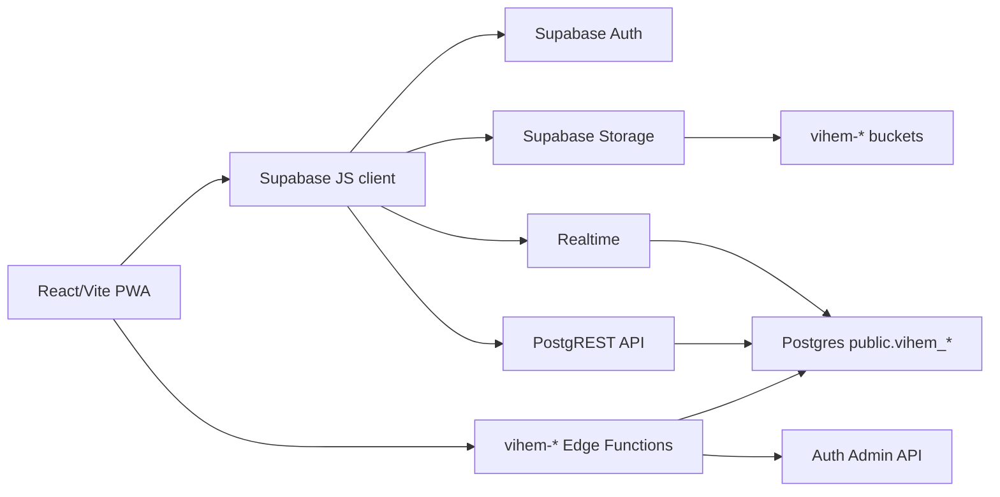

# VI-HEM teknisk roadmap och arkitektur

Senast uppdaterad: 2026-07-03

## Syfte

VI-HEM ska byggas som en modulär fastighetsplattform där alla funktioner delar samma kärna för organisationer, användare, behörighet, dokument, notiser och audit-logg. Målet är att nya moduler ska kunna läggas till utan att varje modul uppfinner egna användar-, fil-, status- eller behörighetsmodeller.

Detta dokument är styrande för ny utveckling. Nya funktioner ska först placeras in i domänmodellen, datamodellen, API-strukturen och behörighetssystemet nedan.

## Arkitekturprinciper

1. VI-HEM äger prefixet `vihem_` i den delade Supabase-instansen.
2. `auth.users` är gemensam identitet, men all appbehörighet bor i `vihem_profiles`.
3. Alla organisationsägda tabeller ska ha `organisation_id`.
4. Alla användarägda eller handläggarägda rader ska ha tydliga FK-fält, till exempel `created_by`, `assigned_to`, `tenant_id`, `user_id`.
5. Frontend får bara använda `VITE_SUPABASE_URL` och `VITE_SUPABASE_ANON_KEY`.
6. Service-role används endast i Edge Functions med tydliga funktionsprefix: `vihem-*`.
7. RLS är den primära säkerhetsgränsen. Frontendfilter är endast UX.
8. Statusflöden ska vara explicita enum/check constraints, inte fria textfält.
9. Filer ska hanteras via app-prefixed buckets och gemensam attachmentmodell.
10. Migrationer ska vara idempotenta, append-only i produktion och aldrig radera storage-objekt direkt via SQL.
11. Personer, kunder och hyresgäster är inte automatiskt användarkonton.
12. AI får aldrig ändra data direkt. AI ska endast skapa förslag som användaren granskar, redigerar, godkänner eller avslår.

## Systemöversikt



## Domänmodell

### Kärndomän

`Organisation`
: Kund/bolag som använder VI-HEM. Äger licens, moduler, limits, inställningar och all organisationsdata.

`Profile`
: Appens användarprofil kopplad till `auth.users.id`. Innehåller roll, organisation, kontaktinfo, aktiv-status och auth-metod.

`Person`
: Verklig person eller kontakt. Kan vara hyresgäst, kundkontakt, leverantörskontakt, personal eller extern deltagare utan att ha inloggningskonto.

`UserAccount`
: Autentiseringskonto i `auth.users`. Ett konto kan kopplas till en person/profil, men ska inte skapas bara för att en person registreras.

`OrganisationMembership`
: Koppling mellan person/användare och organisation med roll, status och behörigheter. Behövs långsiktigt för konsulter, extern personal och personer med åtkomst till flera organisationer.

`Property`
: Fastighet inom en organisation.

`Apartment`
: Lägenhet/lokal kopplad till fastighet.

`Tenancy`
: Hyresförhållande mellan hyresgäst och lägenhet.

`Document`
: Genererat eller uppladdat dokument kopplat till organisation, hyresgäst, fastighet, lägenhet eller arbetsflöde.

`Notification`
: Intern notis till användare. Notistyp ska vara kontrollerad och moduloberoende.

`AuditEvent`
: Bör införas som gemensam händelselogg för viktiga ändringar.

### Operativa moduler

`MaintenanceRequest`
: Felanmälan från hyresgäst eller personal.

`WorkOrder`
: Arbetsorder skapad av personal/admin, ofta kopplad till felanmälan, fastighet, lägenhet eller kundprojekt.

`TimeEntry`
: Stämplad eller manuellt registrerad tid. Kan kopplas till arbetsorder, felanmälan, kundprojekt eller generell kategori.

`StaffAbsenceRequest`
: Sjuk, VAB, semester, ledighet eller tjänstledighet.

`StaffWorkSchedule`
: Normschema per personal och veckodag.

`LaundryRoom`, `LaundrySlot`, `LaundryBooking`
: Tvättstugebokning med fastighetskoppling och bokningsregler.

`News`
: Nyhet riktad till alla hyresgäster, viss fastighet eller intern målgrupp.

`ChatThread`, `ChatParticipant`, `ChatMessage`
: Chatt mellan personal och hyresgäst eller mellan personal. Hyresgäst till hyresgäst ska inte tillåtas.

`ApartmentInspection`, `ContractSignature`
: Besiktning, avtal och signering med dokumentgenerering.

### Tillval/moduler

`CustomerProject`
: Kundprojekt med kund, offert, material, tid, ändringsorder, egenkontroller, besiktning och fakturaunderlag.

`ShortStayUnit`, `ShortStayBooking`
: Korttidsuthyrning/Airbnb/Booking-enheter, kalenderimport och manuella blockeringar.

`PurchaseItem`
: Gemensam inköpslista grupperad per butik/leverantör.

`StaffLedgerEntry`
: Rekommenderad ny modul för personalliggare/kiosk-läge.

`PlanningItem`
: Generell planeringspunkt i årshjulet. Kan vara fristående eller länka till arbetsorder, möte, projekt, besiktning, underhåll eller egen aktivitet.

`Meeting`, `MeetingTemplate`, `MeetingDecision`, `MeetingActionItem`
: Mötesmodul med mallar, dagordning, protokoll, beslut och åtgärdspunkter.

`AiSuggestion`
: Granskningsbar AI-föreslagen ändring. Innehåller föreslagen åtgärd, målkoppling, förtroendegrad, status, granskare och beslutslogg.

`InventoryItem`
: Lager/inventarie med QR-kod, historik, service, dokument, manualer och koppling till arbetsorder.

`CrmAccount`, `CrmContact`, `CrmActivity`
: Enkel CRM-modell för kunder, kontakter, aktiviteter, offerter och uppföljning.

## Föreslagen databasschema-standard

### Gemensamma kolumner

Alla nya organisationsägda tabeller:

```sql
id uuid primary key default gen_random_uuid(),
organisation_id uuid not null references vihem_organisations(id) on delete cascade,
created_by uuid references vihem_profiles(id),
created_at timestamptz not null default now(),
updated_at timestamptz not null default now(),
deleted_at timestamptz
```

Regler:

- Använd soft delete (`deleted_at`) för affärsdata som kan behöva historik.
- Använd hård delete endast för temporära utkast eller join-tabeller utan historik.
- Lägg index på `organisation_id`, statusfält, datumfält och vanliga FK-fält.
- Alla tabeller som kan växa ska ha paginerbara datumfält.

### Kärntabeller

| Tabell | Ansvar |
| --- | --- |
| `vihem_organisations` | Tenant, licens, modulflaggor, limits |
| `vihem_profiles` | Appprofil och roll per auth-user |
| `vihem_properties` | Fastigheter |
| `vihem_apartments` | Lägenheter/lokaler |
| `vihem_tenancies` | Hyresförhållanden |
| `vihem_documents` | Dokumentmetadata |
| `vihem_notifications` | Notiser |
| `vihem_organisation_notification_settings` | Notisinställningar |
| `vihem_audit_events` | Föreslagen ny gemensam händelselogg |

### Rekommenderade nya gemensamma tabeller

`vihem_persons`
: Normaliserad person-/kontaktmodell. Ska användas för kontakter som inte nödvändigtvis ska kunna logga in.

Fält:

- `organisation_id`
- `display_name`
- `email`
- `phone`
- `person_type`
- `metadata`
- `created_by`

`vihem_memberships`
: Långsiktig ersättning/komplement till att rollen ligger direkt på `vihem_profiles`. Gör det möjligt för en person/användare att ha olika roller i olika organisationer.

Fält:

- `organisation_id`
- `person_id`
- `profile_id`
- `role_key`
- `permissions`
- `status`
- `invited_at`
- `joined_at`

`vihem_files`
: Gemensam filmetadata för alla moduler.

Fält:

- `bucket_id`
- `storage_path`
- `file_name`
- `content_type`
- `size_bytes`
- `owner_type`
- `owner_id`
- `uploaded_by`
- `visibility`

`vihem_module_registry`
: Katalog över moduler och standardlimits.

`vihem_organisation_modules`
: Per organisation: aktiverad modul, limits och modulinställningar.

Detta bör ersätta växande antal kolumner som `customer_projects_enabled`, `short_stay_enabled`, `max_short_stay_units` på `vihem_organisations`.

Föreslaget schema:

```sql
create table vihem_organisation_modules (
  organisation_id uuid references vihem_organisations(id) on delete cascade,
  module_key text not null,
  enabled boolean not null default false,
  limits jsonb not null default '{}',
  settings jsonb not null default '{}',
  created_at timestamptz not null default now(),
  updated_at timestamptz not null default now(),
  primary key (organisation_id, module_key)
);
```

`vihem_planning_items`
: Gemensamt årshjul. Ska kunna representera egna planeringspunkter och länkar till andra objekt.

Fält:

- `organisation_id`
- `title`
- `description`
- `start_at`
- `end_at`
- `item_type`
- `entity_type`
- `entity_id`
- `responsible_user_id`
- `priority`
- `status`
- `recurrence_rule`

`vihem_meetings`
: Möten kopplade till organisation och eventuellt projekt, arbetsorder, fastighet eller kund.

`vihem_meeting_templates`
: Mötes- och dagordningsmallar.

`vihem_meeting_agenda_items`
: Dagordningspunkter.

`vihem_meeting_notes`
: Anteckningar/protokollinnehåll.

`vihem_meeting_decisions`
: Beslut med ansvarig, status och eventuell deadline.

`vihem_meeting_action_items`
: Åtgärdspunkter som kan skapa arbetsorder eller uppgifter.

`vihem_ai_interactions`
: Loggar AI-användning för spårbarhet och framtida debitering.

Fält:

- `organisation_id`
- `user_id`
- `feature_key`
- `model`
- `input_tokens`
- `output_tokens`
- `estimated_cost`
- `created_at`

`vihem_ai_suggestions`
: Gemensam modell för AI-förslag.

Fält:

- `organisation_id`
- `created_by`
- `source_type`
- `source_id`
- `suggestion_type`
- `target_type`
- `target_id`
- `payload`
- `confidence`
- `status`
- `reviewed_by`
- `reviewed_at`

`vihem_inventory_items`
: Lager och inventarier med QR-kod och servicehistorik.

`vihem_crm_accounts`, `vihem_crm_contacts`, `vihem_crm_activities`
: CRM-kund, kontaktpersoner och uppföljningsaktiviteter.

## Modulgränser

Varje modul ska ha:

- egen page/component-yta
- egen dataaccess-fil eller service
- egna tabeller med `vihem_` prefix
- egna statusar och eventtyper
- RLS som utgår från kärnfunktioner
- notiser via gemensam notisfunktion
- dokument/filer via gemensam filmodell

Moduler får inte:

- läsa andra organisationers data
- skapa egna rollsystem
- skapa egna fil-buckets utan arkitekturbeslut
- direkt manipulera `auth.users` från frontend
- skapa duplicerade användar-/kund-/fastighetsbegrepp utan tydligt behov
- anropa AI-leverantörer direkt från frontend
- utföra AI-föreslagna ändringar utan användargodkännande

### Rekommenderad frontendstruktur

Nuvarande `src/pages` kan fungera kortsiktigt, men bör stegvis flyttas mot:

```text
src/
  app/
    routing/
    layout/
  core/
    auth/
    permissions/
    notifications/
    files/
    supabase/
  modules/
    properties/
    tenants/
    maintenance/
    work-orders/
    time-tracking/
    laundry/
    documents/
    news/
    chat/
    inspections/
    customer-projects/
    short-stay/
    purchasing/
    staff-ledger/
```

Varje modul:

```text
modules/{module}/
  api.ts
  types.ts
  permissions.ts
  components/
  pages/
```

## API-struktur

### Frontend till Supabase

Frontend får använda Supabase REST direkt för vanliga CRUD-flöden där RLS räcker.

Exempel:

- läsa egna data
- lista org-scopade resurser
- skapa felanmälan
- boka tvättid
- läsa notiser

### Edge Functions

Edge Functions ska användas för:

- skapa användare
- återställa lösenord som admin
- skicka återställningsmejl
- uppdatera auth-user
- importera/exportera kalenderflöden
- framtida PDF-generering
- framtida integrationsjobb
- all AI-kommunikation
- AI-förslag som analyserar dokument, möten, arbetsorder eller projekt
- operationer som kräver service role

Konvention:

```text
vihem-{module}-{action}
```

Exempel:

```text
vihem-users-create
vihem-users-reset-password
vihem-short-stay-sync-ical
vihem-documents-generate-contract-pdf
vihem-notifications-dispatch
vihem-ai-analyze-meeting
vihem-ai-create-suggestions
vihem-ai-assistant-query
```

Nuvarande funktioner kan behållas, men nya ska följa `{module}-{action}`.

### AI API-kontrakt

Frontend skickar endast användarens uttryckliga begäran och referenser till backend, aldrig hemliga nycklar eller direkt AI-anrop.

Exempel:

```json
{
  "source_type": "meeting_note",
  "source_id": "uuid",
  "instruction": "Föreslå arbetsorder och projektuppdateringar",
  "context_scope": {
    "organisation_id": "uuid",
    "allowed_modules": ["work_orders", "customer_projects", "properties"]
  }
}
```

Edge Function ansvarar för:

- behörighetskontroll
- hämtning av organisationsdata
- dataminimering
- AI-anrop
- loggning i `vihem_ai_interactions`
- skapande av `vihem_ai_suggestions`

AI-svar får aldrig direkt uppdatera affärstabeller. Det ska omvandlas till förslag:

```json
{
  "suggestions": [
    {
      "suggestion_type": "create_work_order",
      "target_type": "property",
      "target_id": "uuid",
      "payload": {
        "title": "Byt spis i lägenhet 1001",
        "assigned_to": "uuid",
        "due_date": "2026-07-10"
      },
      "confidence": 0.82
    }
  ]
}
```

### Felformat

Alla Edge Functions ska returnera:

```json
{
  "error": "Mänskligt läsbart fel",
  "code": "MACHINE_READABLE_CODE",
  "details": {}
}
```

Vid success:

```json
{
  "data": {}
}
```

## Behörighetssystem

### Roller

`superadmin`
: VI-HEM drift/ägare. Ser alla organisationer och hanterar licenser, moduler och superadmins.

`admin`
: Organisationsadmin. Hanterar organisationens användare, fastigheter, lägenheter, moduler och personal.

`staff`
: Personal. Hanterar driftflöden enligt modulbehörigheter.

`tenant`
: Hyresgäst. Ser egna hyresförhållanden, dokument, tvättbokningar, felanmälan och riktad kommunikation.

### Behörighetslager

1. Auth: är användaren inloggad?
2. Profile: finns aktiv `vihem_profiles`-rad?
3. Organisation: tillhör raden samma `organisation_id`?
4. Roll: har rollen tillräcklig nivå?
5. Modul: är modulen aktiverad för organisationen?
6. Objekt: är användaren ägare, deltagare, tilldelad eller målgrupp?

### Databasfunktioner

Alla RLS-policies bör använda gemensamma helper-funktioner:

```sql
vihem_get_my_role()
vihem_get_my_org_id()
vihem_is_superadmin()
vihem_is_admin()
vihem_is_staff()
vihem_module_enabled(module_key text)
vihem_can_access_org(org_id uuid)
```

Undvik policies som själva frågar samma tabell direkt, särskilt `vihem_profiles`, eftersom det kan ge RLS-rekursion.

### RLS-mall

Organisationsägda tabeller:

```sql
using (
  vihem_get_my_role() = 'superadmin'
  or organisation_id = vihem_get_my_org_id()
)
```

Admin-write:

```sql
with check (
  vihem_get_my_role() = 'superadmin'
  or (
    organisation_id = vihem_get_my_org_id()
    and vihem_get_my_role() = 'admin'
  )
)
```

Tilldelade objekt:

```sql
using (
  organisation_id = vihem_get_my_org_id()
  and (
    vihem_get_my_role() in ('admin', 'staff')
    or assigned_to = auth.uid()
    or auth.uid() = any(assigned_to_ids)
  )
)
```

## Modulmatris

| Modul | Admin | Staff | Tenant | Superadmin |
| --- | --- | --- | --- | --- |
| Organisationer/licens | Nej | Nej | Nej | Full |
| Fastigheter/lägenheter | Full | Läs vid behov | Egen lägenhet | Läs/limit |
| Hyresgäster | Full | Läs vid behov | Eget konto | Läs/limit |
| Felanmälan | Full | Handlägga | Skapa/läsa egna | Läs |
| Arbetsorder | Full | Skapa/handlägga | Nej | Läs |
| Tidrapport | Se/redigera alla | Egen tid/frånvaro | Nej | Läs |
| Tvättbokning | Alla rum i org | Alla rum i org | Egen fastighet | Läs |
| Dokument | Full | Skapa/läsa enligt org | Egna/riktade | Läs |
| Nyheter | Full | Skapa/publicera enligt regel | Läsa riktade | Läs |
| Chatt | Org-chattar | Personal/hyresgäst/personalgrupp | Personalchatt, ej tenant-tenant | Läs vid support |
| Kundprojekt | Modulstyrt full | Tilldelade/projekttid | Nej | Licens/limits |
| Korttidsuthyrning | Full | Hantera bokningar | Nej | Licens/limits |
| Inköpslista | Full | Full | Nej | Läs |
| Personalliggare | Full | Stämpla | Nej | Läs |
| Årshjul | Full | Läsa/skapa enligt behörighet | Begränsat vid tenant-aktiviteter | Läs/limits |
| Möten | Full | Delta/skapa enligt behörighet | Extern deltagare vid behov | Läs/limits |
| AI | Konfigurera/granska | Skapa/granska egna förslag | Nej initialt | Förbrukning/limits |
| Lager/inventarier | Full | Hantera enligt behörighet | Nej | Läs/limits |
| CRM | Full | Läsa/skapa enligt behörighet | Nej | Läs/limits |

## Status- och eventstandard

Alla moduler ska definiera:

- `status`
- `status_changed_at`
- `status_changed_by`
- event i `vihem_audit_events`

Rekommenderade statusfamiljer:

Arbetsflöde:

```text
draft -> submitted/new -> assigned -> started -> waiting_* -> completed/cancelled -> archived
```

Godkännande:

```text
submitted -> approved/rejected -> change_requested
```

Dokument/signering:

```text
draft -> pending_signature -> signed -> archived/cancelled
```

## Notiser

Notiser ska skapas via gemensam funktion, inte spridas manuellt i varje modul.

Föreslagen tabellstandard:

```text
type
title
message
link
actor_id
entity_type
entity_id
read_at
created_at
```

Organisationens notisinställningar ska ligga i `vihem_organisation_notification_settings` eller i framtiden `vihem_organisation_modules.settings`.

## Dashboard som arbetsyta

Dashboarden ska vara användarens huvudsakliga arbetsyta, inte en passiv startsida.

Den ska byggas av modulwidgets som hämtar data via gemensamma API:er och behörighetsfilter.

Första widgetuppsättning:

- dagens arbetsorder
- försenade arbetsorder
- kommande möten
- kommande besiktningar
- projektstatus
- kommande aktiviteter i årshjulet
- frånvaro/sjukanmälan för admin
- personal instämplad just nu
- AI-rekommendationer och väntande AI-förslag

Widgetar ska kunna styras per roll och modulaktivering.

## Dokument och filer

På sikt ska `attachments` JSONB i enskilda moduler ersättas eller kompletteras av `vihem_files`.

Storage buckets:

- `vihem-inspection-photos`
- `vihem-work-order-attachments`
- framtida gemensam bucket: `vihem-files`

Rekommenderad riktning:

1. Inför `vihem_files`.
2. Låt nya moduler använda den.
3. Migrera arbetsorder-/besiktningsbilagor stegvis.
4. Skapa Edge Function för signerade URL:er vid privata filer.

## Roadmap

### Fas 0: Stabilisering

Mål: få en stabil grund efter namespace-arbetet.

- Säkerställ att deploy alltid gör `git pull` före migrationer.
- Kör alla migrationsfixar i produktion.
- Verifiera `vihem_profiles`, `vihem_organisations` och RLS.
- Dokumentera produktionskommandon och rollback.
- Lägg till rökprov efter deploy:
  - login
  - läs profil
  - läs organisation
  - skapa/läs notis

### Fas 1: Kärnplattform

Mål: gemensamma grundtjänster innan nya moduler.

- Inför `vihem_organisation_modules`.
- Inför `vihem_persons`.
- Inför `vihem_memberships`.
- Inför `vihem_audit_events`.
- Inför `vihem_files`.
- Inför gemensam `entity_type`/`entity_id`-standard för kopplingar mellan moduler.
- Samla permission helpers i SQL och frontend.
- Skapa modulregistry i frontend.
- Standardisera Edge Function-responsformat.

### Fas 2: Dataaccess och modulstruktur

Mål: minska direkt-Supabase-anrop utspridda i pages.

- Skapa `src/core/supabase`.
- Flytta varje modul till `src/modules/{module}`.
- Lägg CRUD i `api.ts` per modul.
- Inför gemensam felhantering.
- Inför gemensam paginering/sök/filter.

### Fas 3: Operativ robusthet

Mål: göra befintliga moduler färdiga för verklig drift.

- Arbetsorder/felanmälan:
  - gemensam assignmentmodell
  - filmodell via `vihem_files`
  - arkivflöden
  - audit-logg
- Tidrapport:
  - sammanhållen timesheetmodell
  - frånvaro och schema i samma kalendergrund
  - övertid/avvikelseberäkning
- Dokument:
  - PDF-generering i Edge Function
  - privata filer där det behövs
  - koppling till hyresgästportal

### Fas 4: Moduler och integrationer

Mål: bygga nya moduler på samma grund.

- Årshjul:
  - årsöversikt
  - månadsöversikt
  - veckovy
  - ansvarig/status/prioritet
  - länkar till projekt, arbetsorder, underhåll, besiktningar och möten
- Möten:
  - mötesmallar
  - dagordningsmallar
  - protokoll
  - beslut
  - åtgärdspunkter
  - AI-förslag från anteckningar
- AI:
  - backend-only AI-anrop
  - `vihem_ai_interactions`
  - `vihem_ai_suggestions`
  - granskningsvy för förslag
  - AI-assistent för organisationsfrågor
- Personalliggare:
  - kiosk-login per organisation
  - staff/guest clock-in
  - kontrollvy
  - koppling mot schema
- Korttidsuthyrning:
  - kalenderimport
  - gästaccess/tvättbokning
  - städstatus
  - lås-/accessintegration för framtiden
- Kundprojekt:
  - offertflöde
  - materialpåslag
  - fakturaunderlag
  - dokument/filer via gemensam filmodell
- Lager/inventarier:
  - QR-koder
  - servicehistorik
  - manualer/dokument
  - materialkoppling till arbetsorder
- CRM:
  - kunder
  - kontakter
  - aktiviteter
  - offerter
  - uppföljning

### Fas 5: Plattformskvalitet

Mål: minska framtida risk.

- E2E-test för login och rollflöden.
- RLS-testsvit i SQL.
- CI-build med `npm run typecheck` och `npm run build`.
- Migration dry-run mot staging.
- Databasbackup före produktionsmigrationer.
- Observability:
  - Edge Function logs
  - deploy-loggar
  - audit events
  - felnotiser till superadmin

## Definition of Done för nya funktioner

En ny funktion är inte klar förrän:

- domänobjektet är definierat
- tabeller har `organisation_id` där det behövs
- RLS-policy finns
- roller och modulflagga är definierade
- API/dataaccess ligger i modulens `api.ts`
- felmeddelanden är användbara
- notiser/audit/dokument/filer följer gemensam modell
- migrationen är idempotent
- `npm run typecheck` och `npm run build` passerar

## Beslut som bör tas innan nästa större funktion

1. Ska `vihem_organisation_modules` ersätta dagens modulkolumner?
2. Ska alla bilagor framåt gå via `vihem_files`?
3. Ska personalliggare byggas som kiosk-läge i samma app eller separat PWA-route?
4. Ska dokument/PDF genereras i Supabase Edge Functions eller separat backend?
5. Ska gamla direkta page-anrop flyttas modul för modul eller endast vid berörd utveckling?
6. Ska `vihem_persons` och `vihem_memberships` införas innan CRM/möten/AI byggs?
7. Ska årshjulet vara en egen primär modul eller en gemensam planeringsyta som alla moduler skriver till?
8. Vilken AI-leverantör/modellstrategi ska användas och hur ska kostnader debiteras per organisation?
9. Ska AI-assistenten få läsa dokumentinnehåll direkt eller endast indexerade/sammanfattade dokument?
10. Ska dashboarden konfigureras per organisation, per roll eller per användare?
