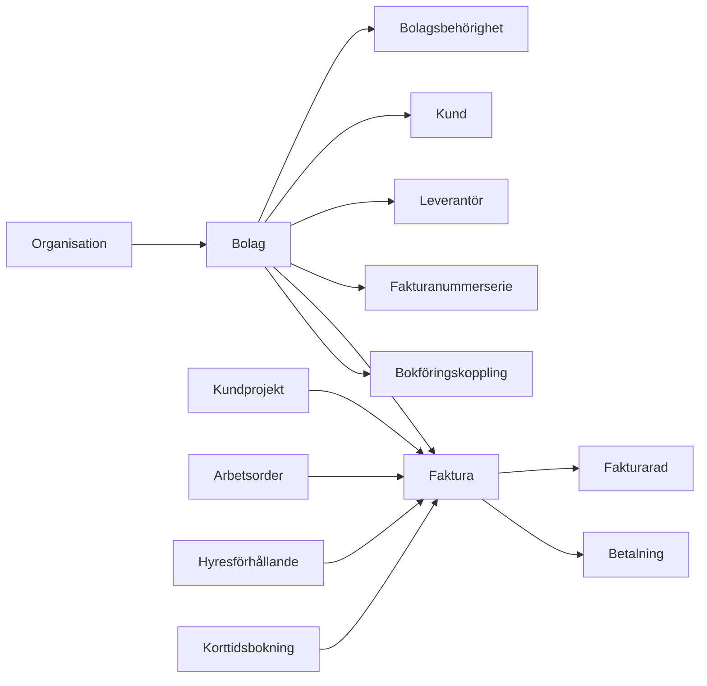

# VI-HEM ekonomi och fakturering

## Syfte

Ekonomimodulen ska ge VI-HEM en gemensam grund för bolag, kunder, leverantörer, fakturor, betalningar och framtida bokföringskopplingar. Den ska kunna användas av fastighetsförvaltning, kundprojekt, hyresdebitering och korttidsuthyrning utan att varje modul bygger egen ekonomi.

## Nuläge i systemet

- VI-HEM har redan organisationsnivå (`vihem_organisations`) och rollbaserad åtkomst via `vihem_profiles`.
- De flesta nya tabeller ligger i VI-HEM-namnrymden med prefixet `vihem_`, vilket är viktigt i den delade Supabase-instansen.
- Moduler styrs via `vihem_module_registry`, `vihem_organisation_modules` och funktionen `vihem_module_enabled`.
- Återanvändbara domäner finns redan: fastigheter, lägenheter, hyresförhållanden, dokument, arbetsordrar, kundprojekt, tidrapportering och korttidsbokningar.
- Det saknas en tydlig juridisk bolagsnivå. `organisation` är kund/tenant i SaaS-systemet, medan fakturering behöver kunna ske från ett eller flera juridiska bolag inom organisationen.

## Domänmodell

## Modulgränser

- **Ekonomi** äger bolag, kunder, leverantörer, fakturor, fakturarader, betalningar, nummerserier, ekonomiaudit och bokföringskopplingar.
- **Kundprojekt** får skapa fakturaunderlag men ska inte äga fakturan eller bokföringsstatus.
- **Hyra/Hyresförhållanden** får skapa återkommande debiteringar men ska gå via samma fakturabas.
- **Korttidsuthyrning** får ta in prisuppgifter och betalstatus från kanal, men ska bara skapa kvitto/faktura via ekonomi.
- **Dokument** används för PDF:er, kvitton, avtal och fakturabilagor men äger inte fakturadata.

## Databasprinciper

- Alla nya tabeller ska börja med `vihem_`.
- Alla ekonomiobjekt ska ha `organisation_id`.
- Alla transaktionella ekonomiobjekt ska ha `company_id`.
- Tabeller som kan kopplas till ekonomi får `company_id` som nullable migrationssteg: fastigheter, lägenheter, hyresförhållanden, kundprojekt, arbetsordrar, tidrader och dokument.
- Fakturanummer får bara delas ut från en låst nummerserie, aldrig manuellt i frontend.
- Historik och ändringar loggas i `vihem_finance_audit_log`.
- Bokföringsleverantörer abstraheras bakom `vihem_accounting_integrations` och framtida edge functions/adaptrar.

## Behörigheter

- `superadmin` kan se och hantera alla bolag.
- `admin` kan hantera bolag och ekonomi inom sin organisation.
- Personal kan få bolagsbehörighet via `vihem_company_user_permissions`.
- Roller på bolag: `viewer`, `seller`, `bookkeeper`, `approver`, `admin`.
- Personal ska kunna registrera tid/material på kundprojekt utan att se marginal, påslag, debiteringssammanställning eller bokföringsdata.
- Hyresgäster ska aldrig läsa interna ekonomiobjekt direkt.

## API och edge functions

Phase 1 kan använda Supabase direkt för admin-CRUD. Därefter bör känsliga flöden flyttas till edge functions:

- `finance-create-invoice`: skapar faktura från källa.
- `finance-approve-invoice`: låser fakturan och hämtar nästa fakturanummer i transaktion.
- `finance-render-invoice-pdf`: skapar PDF och sparar dokument.
- `finance-send-invoice-email`: plockar köade fakturamejl, hämtar PDF-dokument och skickar via SMTP/Postfix eller vald e-postleverantör.
- `finance-sync-accounting`: synkar mot vald bokföringsadapter.
- `finance-import-supplier-invoice`: tar emot fil/e-post och startar OCR.
- `finance-register-payment`: tar emot bank-/bokföringsstatus.

## Bakgrundsjobb

- Skapa hyresfakturor inför förfallodag.
- Skapa fakturaunderlag från godkända kundprojektrader.
- Synka bokföringsstatus.
- Synka betalstatus.
- OCR-tolka leverantörsfakturor.
- Skicka påminnelser och flagga förfallna fakturor.
- Uppdatera förfallna kundfakturor via schemalagd edge function.

## OCR och AI-pipeline

1. Fil laddas upp till dokument/storage.
2. Edge function extraherar text och metadata.
3. AI föreslår leverantör, OCR-rader, belopp, moms, förfallodag och kontering.
4. Förslag sparas som utkast.
5. Admin/bokförare godkänner.
6. Leverantörsfaktura går till betal-/bokföringsflöde.

## Bokföringsadaptrar

Ekonomimodulen ska inte hårdkodas mot en leverantör. Adapterlagret ska normalisera:

- kunder
- leverantörer
- fakturor
- fakturarader
- betalningar
- konton och momskoder
- synkstatus och felmeddelanden

Aktuella första adapterkandidater: Spiris, Accounted, Fortnox, SIE-export och manuell CSV.

## UI-struktur

- Ekonomiöversikt
- Bolag
- Kunder
- Leverantörer
- Fakturor
- Utkast/fakturaunderlag
- Betalningar
- Nummerserier
- Bokföringskopplingar
- Inställningar
- Audit/logg

## Roadmap

### Phase 1: Grund

- Ekonomimodul i modulregistret.
- Multi-company.
- Bolagsbehörigheter.
- Kundregister.
- Leverantörsregister.
- Fakturabas, fakturarader och betalningar.
- Fakturanummerserier.
- Första adminvy för bolag, kunder och fakturautkast.

### Phase 2: Fakturaflöde

- Godkännande.
- Transaktionell nummersättning.
- PDF-generering.
- Dokumentkoppling.
- E-postutskick.
- Kreditfakturor.
- Betalstatus.

Status i kod:

- Serverfunktion för godkännande och låst fakturanummer finns.
- Serverfunktion för att markera faktura som skickad finns.
- Serverfunktion för manuell betalningsregistrering finns.
- Fakturatotaler räknas om från fakturarader med trigger.
- Fakturadokument kan genereras som VI-HEM-dokument från adminvyn.
- Faktura-PDF skapas med strukturerad fakturamall och laddas upp i `vihem-documents` med dokumentkoppling på fakturan.
- Edge function för serverrenderad faktura-PDF finns som `vihem-render-invoice-pdf`, så fakturadokument kan skapas från backend-flöden och automationer.
- Adminvyn använder serverrenderingen först och faller tillbaka till lokal PDF-generering om edge-funktionen inte är tillgänglig i lokal utveckling.
- Betalningar visas i egen ekonomiflik som historik per bolag, faktura och källa.
- Fakturanummerserier visas i egen ekonomiflik så admin ser prefix, nästa nummer och aktiv status.
- Admin kan skapa och redigera fakturanummerserier med prefix, nästa nummer, padding, räkenskapsår och aktiv status.
- Admin kan välja aktiv nummerserie när ett fakturautkast godkänns.
- Fakturamejl kan köas från fakturadetaljen med mottagare, ämne, meddelande och koppling till faktura-PDF.
- Köade fakturamejl visas i egen ekonomiflik med status och eventuellt felmeddelande.
- Edge function för faktisk SMTP-/Postfix-sändning från e-postkön finns som `vihem-send-invoice-emails`.
- Admin kan skicka alla köade fakturamejl eller en enskild köad rad från ekonomivyn.
- Funktionen kräver servermiljövariablerna `SMTP_HOST` och `SMTP_FROM_EMAIL`. Valfria variabler är `SMTP_PORT`, `SMTP_SECURE`, `SMTP_STARTTLS`, `SMTP_USERNAME`, `SMTP_PASSWORD`, `SMTP_FROM_NAME` och `VIHEM_CRON_SECRET`.
- Kreditfakturor kan skapas som separata utkast från godkända/skickade/betalda fakturor.
- Kreditfakturan får negativa fakturarader och originalfakturan markeras som krediterad när kreditfakturan godkänns.
- Betalningar kan importeras från CSV och matchas mot fakturanummer per bolag.
- Betalimporten är idempotent om exporten innehåller `external_payment_id`; annars skapas ett stabilt dubblettskydd från fakturanummer, datum, belopp och referens.
- Serverfunktion för förfallna kundfakturor finns som `vihem_refresh_overdue_invoices`.
- Admin kan uppdatera förfallna fakturor direkt från Fakturor-fliken.
- Edge function för ekonomi-cron finns som `vihem-finance-cron` och kan köras med `VIHEM_CRON_SECRET` för att markera obetalda fakturor som försenade.
- Samma cron kan köa betalningspåminnelser genom att anropas med `queue_reminders: true`.
- Faktura-e-postkön skiljer nu på vanliga fakturamejl och betalningspåminnelser.
- Admin kan köa betalningspåminnelser för förfallna obetalda fakturor från E-post-fliken.
- Påminnelsefunktionen kan köras både av admin i appen och av service-role cron.
- Påminnelseflödet har spärr mot påminnelsespam: första påminnelsen tidigast 1 dag efter förfall, minst 7 dagar mellan påminnelser och max 3 påminnelser per faktura.
- Påminnelseavgift sparas nu som snapshot på varje köad påminnelse och visas i e-postfliken, så historiken inte ändras om bolagets inställningar ändras senare.
- Bokföringssynk har fått en provider-oberoende exportkö för fakturor, betalningar, kunder, leverantörer och leverantörsfakturor.
- Admin kan köa en låst faktura för bokföring från fakturadetaljen och följa status i Bokföring-fliken.
- Admin kan manuellt markera bokföringsköposter som bearbetas, synkade, misslyckade, avbrutna eller återköade.
- När en fakturapost i bokföringskön markeras synkad eller misslyckad uppdateras fakturans `accounting_status`.
- Edge function för manuell CSV-export av aktiva bokföringsköposter finns som `vihem-export-accounting-csv`.
- Admin kan ladda ner aktiva köposter som CSV från Bokföring-fliken.
- Kvar: riktiga adapter-edge-functions för direkt bank-/bokföringssynk.

### Phase 3: Hyra och kundprojekt

- Återkommande hyresdebitering.
- Fakturaunderlag från kundprojekt, tid och material.
- Rättighetsseparation så personal kan rapportera men admin ser ekonomi.

Status i kod:

- Kundprojektens befintliga faktureringsunderlag visas i ekonomimodulen.
- Admin kan omvandla ett projektunderlag till ett vanligt fakturautkast.
- Underlaget markeras som fakturerat och kopplas till skapad faktura för att undvika dubbletter.
- Återkommande hyresdebitering finns som körning per bolag och hyresmånad.
- Hyreskörningen hämtar aktiva hyresförhållanden, skapar ekonomikund för hyresgästen vid behov och kan generera fakturautkast.
- Admin kan granska hyresraderna i en körning och hoppa över en rad innan fakturautkast skapas.
- Hyresförfallodag sätts till sista dagen i månaden före hyresperioden, exempelvis 31 maj för juni-hyran.
- Kvar: automatisk schemakörning, autogiro/e-post, hyresjusteringar, påminnelser, automatisk kundmatchning från projektkund till ekonomikund och samlad fakturering av flera underlag.

### Phase 4: Leverantörsfakturor

- Leverantörsfakturainbox.
- OCR/AI-förslag.
- Godkännandeflöden.
- Bilagor och attest.

Status i kod:

- Leverantörsfakturor och fakturarader finns som egna tabeller.
- Admin kan registrera leverantörer och leverantörsfakturor manuellt.
- Admin kan bifoga PDF/bild vid registrering av leverantörsfaktura.
- Bilagan sparas som VI-HEM-dokument med kategorin `supplier_invoice` och kopplas till leverantörsfakturan.
- Leverantörsfakturan markeras som OCR-köad när en bilaga laddas upp, så OCR/AI kan byggas som separat efterföljande steg.
- Edge function för att behandla OCR-kön finns som `vihem-process-supplier-invoice-ocr`.
- Första OCR-steget använder filmetadata och markerar leverantörsfakturor som `needs_review`, så samma flöde kan ersättas med riktig OCR/AI senare.
- Admin kan köra OCR-kön från leverantörsfakturafliken och se OCR-underlag i granskningsvyn.
- Edge function för inkommande leverantörsfakturor finns som `vihem-ingest-supplier-invoice`.
- Inkommande fakturor kan tas emot via inloggat admin-/bokföraranrop eller via serverhemligheten `VIHEM_SUPPLIER_INVOICE_INBOUND_SECRET`.
- Ingest-flödet matchar eller skapar leverantör, skapar leverantörsfaktura, sparar bilaga som dokument och lägger bilagan i OCR-kön.
- Admin kan öppna leverantörsfakturor i en granskningsvy och justera leverantör, datum, konto, radtext, belopp, moms, anteckning och bilaga innan attest.
- Serverfunktion för attest/godkännande finns.
- Attesterade leverantörsfakturor kan markeras som planerade för betalning eller betalda.
- När leverantörsfakturor planeras/betalas köas de till bokföringssynken för kommande adapterflöde.
- OCR-status och OCR-data är förberedda i datamodellen.
- Kvar: faktisk e-postadapter som skickar mailbilagor till ingest-funktionen, riktig AI/OCR-tolkning av dokumentinnehåll och faktisk betalfil/bankkoppling.

### Phase 5: Integrationer

- Bokföringsadaptrar.
- Bank-/betalstatus.
- SIE/CSV-export.
- Webhooks och schemalagda synkar.

Status i kod:

- Bokföringskopplingar kan läggas upp per bolag för Spiris, Accounted, Fortnox, SIE och manuell hantering.
- Bokföringssynk köas i `vihem_accounting_sync_queue` med status, försök, externt id och felmeddelande.
- Manuell CSV-export finns för aktiva köposter tills riktig adapter är inkopplad.
- Kvar: riktiga adapter-edge-functions, tokenhantering och schemalagd hantering av köade poster.

## Viktiga beslut innan senare faser

- Vilka juridiska bolag som ska finnas i Vibogruppen.
- Om hyresfakturor ska gå via samma bolag som fastigheten ägs av.
- Vilket bokföringssystem som ska prioriteras först.
- Om betalningar ska matchas från bokföringssystem, bankfil eller manuellt.
- Vilken fakturamall och nummerseriestruktur som ska användas.
