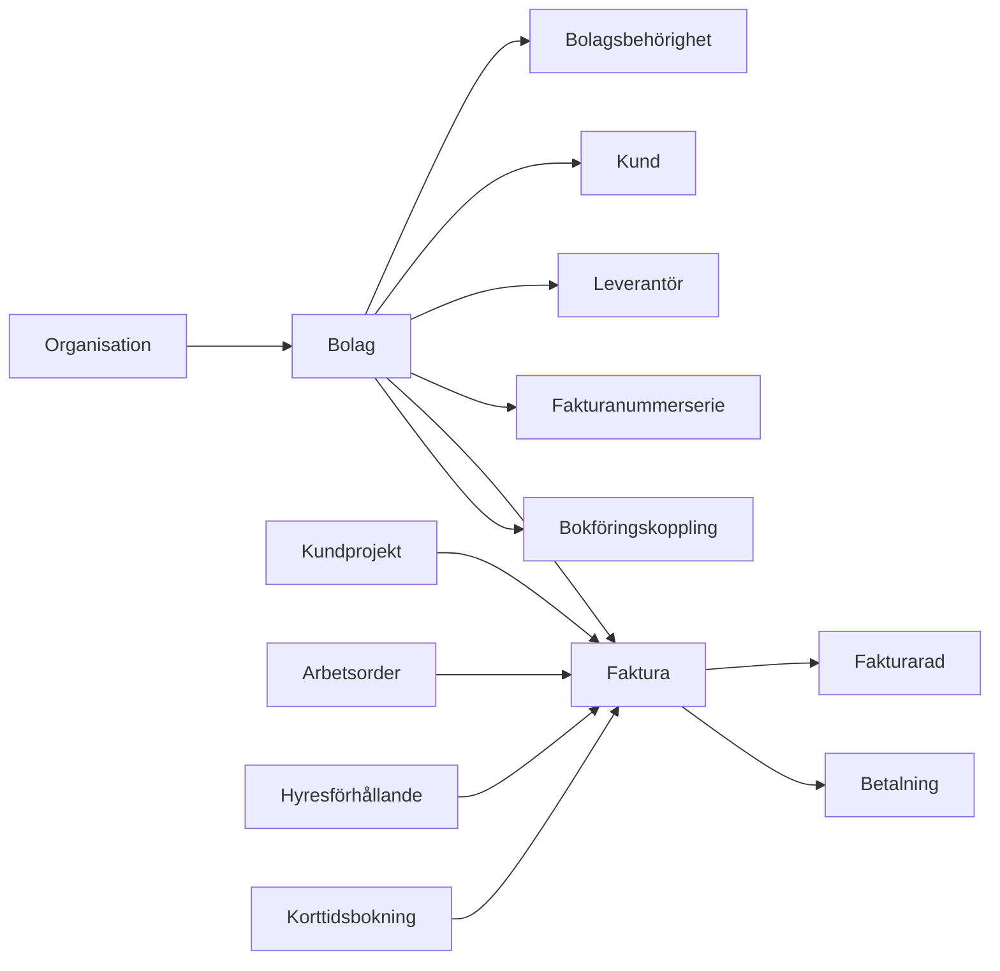

# VI-HEM ekonomi och fakturering

## Syfte

Ekonomimodulen ska ge VI-HEM en gemensam grund för bolag, kunder, leverantörer, fakturor, betalningar och framtida bokföringskopplingar. Den ska kunna användas av fastighetsförvaltning, kundprojekt, hyresdebitering och korttidsuthyrning utan att varje modul bygger egen ekonomi.

## Nuläge i systemet

- VI-HEM har redan organisationsnivå (`vihem_organisations`) och rollbaserad åtkomst via `vihem_profiles`.
- De flesta nya tabeller ligger i VI-HEM-namnrymden med prefixet `vihem_`, vilket är viktigt i den delade Supabase-instansen.
- Moduler styrs via `vihem_module_registry`, `vihem_organisation_modules` och funktionen `vihem_module_enabled`.
- Återanvändbara domäner finns redan: fastigheter, lägenheter, hyresförhållanden, dokument, arbetsordrar, kundprojekt, tidrapportering och korttidsbokningar.
- Det saknas en tydlig juridisk bolagsnivå. `organisation` är kund/tenant i SaaS-systemet, medan fakturering behöver kunna ske från ett eller flera juridiska bolag inom organisationen.

## Domänmodell

## Modulgränser

- **Ekonomi** äger bolag, kunder, leverantörer, fakturor, fakturarader, betalningar, nummerserier, ekonomiaudit och bokföringskopplingar.
- **Kundprojekt** får skapa fakturaunderlag men ska inte äga fakturan eller bokföringsstatus.
- **Hyra/Hyresförhållanden** får skapa återkommande debiteringar men ska gå via samma fakturabas.
- **Korttidsuthyrning** får ta in prisuppgifter och betalstatus från kanal, men ska bara skapa kvitto/faktura via ekonomi.
- **Dokument** används för PDF:er, kvitton, avtal och fakturabilagor men äger inte fakturadata.

## Databasprinciper

- Alla nya tabeller ska börja med `vihem_`.
- Alla ekonomiobjekt ska ha `organisation_id`.
- Alla transaktionella ekonomiobjekt ska ha `company_id`.
- Tabeller som kan kopplas till ekonomi får `company_id` som nullable migrationssteg: fastigheter, lägenheter, hyresförhållanden, kundprojekt, arbetsordrar, tidrader och dokument.
- Fakturanummer får bara delas ut från en låst nummerserie, aldrig manuellt i frontend.
- Historik och ändringar loggas i `vihem_finance_audit_log`.
- Bokföringsleverantörer abstraheras bakom `vihem_accounting_integrations` och framtida edge functions/adaptrar.

## Behörigheter

- `superadmin` kan se och hantera alla bolag.
- `admin` kan hantera bolag och ekonomi inom sin organisation.
- Personal kan få bolagsbehörighet via `vihem_company_user_permissions`.
- Roller på bolag: `viewer`, `seller`, `bookkeeper`, `approver`, `admin`.
- Personal ska kunna registrera tid/material på kundprojekt utan att se marginal, påslag, debiteringssammanställning eller bokföringsdata.
- Hyresgäster ska aldrig läsa interna ekonomiobjekt direkt.

## API och edge functions

Phase 1 kan använda Supabase direkt för admin-CRUD. Därefter bör känsliga flöden flyttas till edge functions:

- `finance-create-invoice`: skapar faktura från källa.
- `finance-approve-invoice`: låser fakturan och hämtar nästa fakturanummer i transaktion.
- `finance-render-invoice-pdf`: skapar PDF och sparar dokument.
- `finance-sync-accounting`: synkar mot vald bokföringsadapter.
- `finance-import-supplier-invoice`: tar emot fil/e-post och startar OCR.
- `finance-register-payment`: tar emot bank-/bokföringsstatus.

## Bakgrundsjobb

- Skapa hyresfakturor inför förfallodag.
- Skapa fakturaunderlag från godkända kundprojektrader.
- Synka bokföringsstatus.
- Synka betalstatus.
- OCR-tolka leverantörsfakturor.
- Skicka påminnelser och flagga förfallna fakturor.

## OCR och AI-pipeline

1. Fil laddas upp till dokument/storage.
2. Edge function extraherar text och metadata.
3. AI föreslår leverantör, OCR-rader, belopp, moms, förfallodag och kontering.
4. Förslag sparas som utkast.
5. Admin/bokförare godkänner.
6. Leverantörsfaktura går till betal-/bokföringsflöde.

## Bokföringsadaptrar

Ekonomimodulen ska inte hårdkodas mot en leverantör. Adapterlagret ska normalisera:

- kunder
- leverantörer
- fakturor
- fakturarader
- betalningar
- konton och momskoder
- synkstatus och felmeddelanden

Aktuella första adapterkandidater: Spiris, Accounted, Fortnox, SIE-export och manuell CSV.

## UI-struktur

- Ekonomiöversikt
- Bolag
- Kunder
- Leverantörer
- Fakturor
- Utkast/fakturaunderlag
- Betalningar
- Nummerserier
- Bokföringskopplingar
- Inställningar
- Audit/logg

## Roadmap

### Phase 1: Grund

- Ekonomimodul i modulregistret.
- Multi-company.
- Bolagsbehörigheter.
- Kundregister.
- Leverantörsregister.
- Fakturabas, fakturarader och betalningar.
- Fakturanummerserier.
- Första adminvy för bolag, kunder och fakturautkast.

### Phase 2: Fakturaflöde

- Godkännande.
- Transaktionell nummersättning.
- PDF-generering.
- Dokumentkoppling.
- E-postutskick.
- Kreditfakturor.
- Betalstatus.

Status i kod:

- Serverfunktion för godkännande och låst fakturanummer finns.
- Serverfunktion för att markera faktura som skickad finns.
- Serverfunktion för manuell betalningsregistrering finns.
- Fakturatotaler räknas om från fakturarader med trigger.
- Fakturadokument kan genereras som VI-HEM-dokument från adminvyn.
- Kvar: riktig serverrenderad PDF/storage, e-postutskick, kreditfakturor och betalimport.

### Phase 3: Hyra och kundprojekt

- Återkommande hyresdebitering.
- Fakturaunderlag från kundprojekt, tid och material.
- Rättighetsseparation så personal kan rapportera men admin ser ekonomi.

Status i kod:

- Kundprojektens befintliga faktureringsunderlag visas i ekonomimodulen.
- Admin kan omvandla ett projektunderlag till ett vanligt fakturautkast.
- Underlaget markeras som fakturerat och kopplas till skapad faktura för att undvika dubbletter.
- Kvar: återkommande hyresdebitering, automatisk kundmatchning från projektkund till ekonomikund och samlad fakturering av flera underlag.

### Phase 4: Leverantörsfakturor

- Leverantörsfakturainbox.
- OCR/AI-förslag.
- Godkännandeflöden.
- Bilagor och attest.

Status i kod:

- Leverantörsfakturor och fakturarader finns som egna tabeller.
- Admin kan registrera leverantörer och leverantörsfakturor manuellt.
- Serverfunktion för attest/godkännande finns.
- OCR-status och OCR-data är förberedda i datamodellen.
- Kvar: filinbox, e-postimport, AI/OCR-tolkning och betalfil/bankkoppling.

### Phase 5: Integrationer

- Bokföringsadaptrar.
- Bank-/betalstatus.
- SIE/CSV-export.
- Webhooks och schemalagda synkar.

Status i kod:

- Bokföringskopplingar kan läggas upp per bolag för Spiris, Accounted, Fortnox, SIE och manuell hantering.
- Kvar: riktiga adapter-edge-functions, tokenhantering, synklogg och felåterföring.

## Viktiga beslut innan senare faser

- Vilka juridiska bolag som ska finnas i Vibogruppen.
- Om hyresfakturor ska gå via samma bolag som fastigheten ägs av.
- Vilket bokföringssystem som ska prioriteras först.
- Om betalningar ska matchas från bokföringssystem, bankfil eller manuellt.
- Vilken fakturamall och nummerseriestruktur som ska användas.
